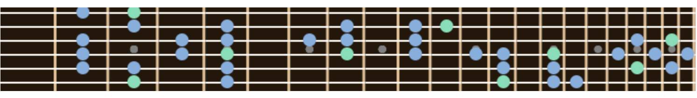
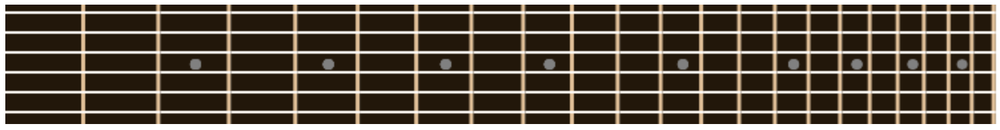
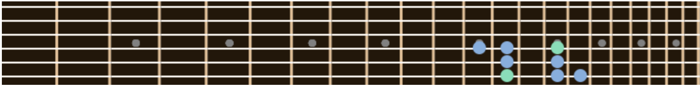
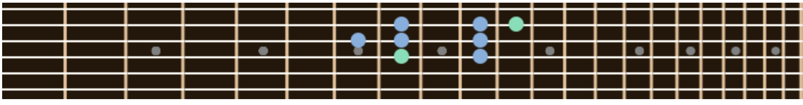
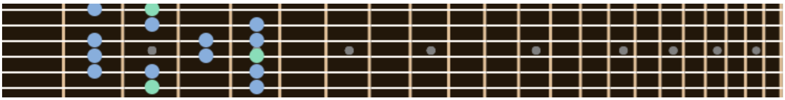

# Scales

Scales is a library for drawing scale diagrams on a guitar fretboard.
Currently, it supports only a guitar fretboard in standard tuning.

The library draws in an html5 `canvas` element.

It is written in EcmaScript 6 and it has been tested in Safari 10.0.1 and Vivaldi 1.5.658.42, which uses Chromium and is compatible with Chrome 54.

## Use

The library is very easy to use.
You should provide an html5 canvas, where the library will draw a guitar neck and scales

    <canvas id="theCanvas" width="1000" height="90" style="border:0px solid #000000;">
       Does yout browser support the canvas tag?
    </canvas>

Drawing a a fretboard requires creation of a Fretboard object, the canvas object is a required construction parameter

    const fretboard = new Fretboard(document.getElementById('theCanvas'));

you may specify a number of frets

    const fretboard = new Fretboard(document.getElementById('theCanvas'), 24);

Drawing scales is done with the method `drawScale` of the Fretboard object. Scales are defined in a global scale object.

The `drawScale` method requires a scale definition and a starting fret

	// dorian scale at twelvth fret
    fretboard.drawScale(scale.dorian, 12);

An optional parameter, allows to specify the starting string

	// major scale at eighth fret, starting on fourth string
    fretboard.drawScale(scale.major, 7, 4);

A second optional parameter allows to specify the number of steps in the scale to be drawn, as a musical interval, so 8 is an octave and 15 is two octaves.

    // major scale at thid fret, spanning two octaves 
    fretboard.drawScale(scale.major, 2, 6, 15);

## Scale definitions

Scales are defined as an array of intervals, espressed in semitones. These are the current definitions:

	const scale = {
	    major: [2, 2, 1, 2, 2, 2, 1],
	    jonian: [2, 2, 1, 2, 2, 2, 1],
	    dorian: [2, 1, 2, 2, 2, 1, 2],
	    phrygian: [1, 2, 2, 2, 1, 2, 2],
	    lydian: [2, 2, 2, 1, 2, 2, 1],
	    mixolydian: [2, 2, 1, 2, 2, 1, 2],
	    eolian: [2, 1, 2, 2, 1, 2, 2],
	    locrian: [1, 2, 2, 1, 2, 2, 2],
	    hexatonic: [2, 2, 2, 2, 2, 2],
	    minor: [2, 1, 2, 2, 1, 2, 2],
	    jazz_minor: [2, 1, 2, 2, 2, 2, 1],
	};

## Themes

The colors of the different visual elements are specified in a theme.
The default theme provided is this:

	// theme based on burlywood color and suggested variations
	// See http://www.colorhexa.com/deb887
	const theme = {
	    neck: '#221709',
	    dot: '#808080',
	    fret: '#e2c196',
	    string: '#fcf8f3',
	    fundamental: '#87deb8',
	    scale: '#87adde'
	};

## How it works

The library starts drawing a scale according to its definition, from the specified string and the specified fret.

It goes on from there adding notes and keeping the fingering within four frets. When a note would be too distant from the initial position, we skip a string.

The algorithm could be enhanced allowing different positions, like starting on something other than the index or middle finger, as it currently does.